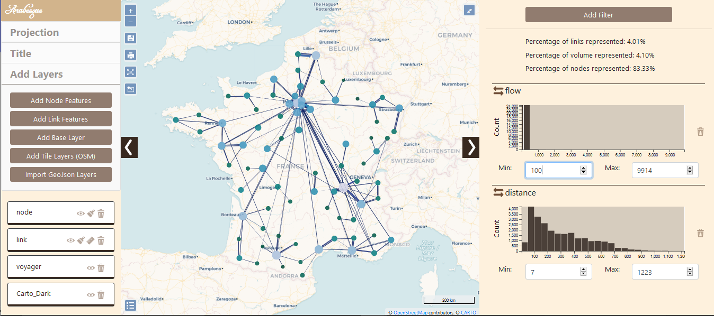
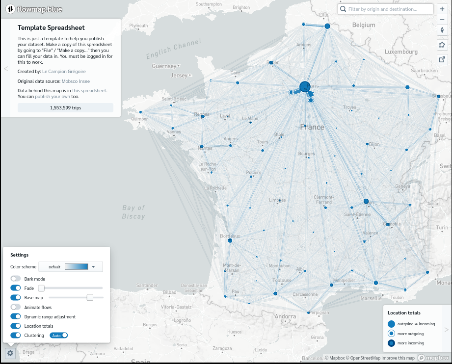
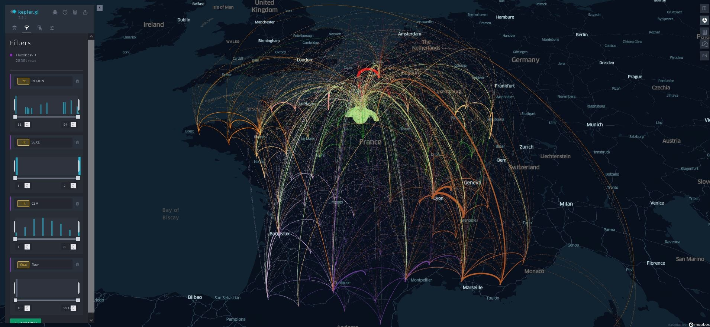
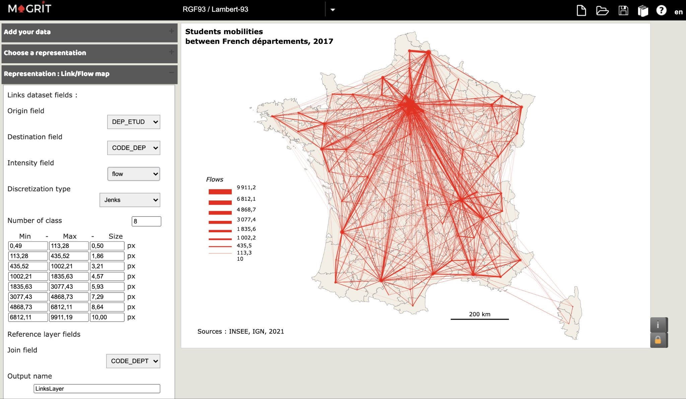

```{r setup, include=FALSE}
options(htmltools.dir.version = FALSE)
knitr::opts_chunk$set(
  fig.width=9, fig.height=3.5, fig.retina=3,
  out.width = "100%",
  cache = FALSE,
  echo = TRUE,
  message = FALSE, 
  warning = FALSE,
  hiline = TRUE
)
```

```{r xaringan-themer, include=FALSE, warning=FALSE}
library(xaringanthemer)
style_duo_accent(
  primary_color = "#2f2a85",
  secondary_color = "#2f2a85",
  inverse_header_color = "#ef7d00",
  inverse_link_color  = "#ef7d00"
)
```

class: inverse center middle title-slide

# ONE ARABESQUE IN THE SMALL WORLD OF OD WEBMAPS

#### <span style='color:#ef7d00;'>Nicolas Roelandt</span>, Françoise Bahoken, Grégoire Le Campion, Laurent Jégou, Marion Maisonobe, Boris Mericskay, Etienne Côme

.bottom[
### <span style='color:#ef7d00;'>_FOSS4G 2021 - remote_</span>

```{r logos-institution, echo=FALSE, out.width="100%", eval=TRUE}

```
]

###### Press <span style='color:#ef7d00;'>P</span> to access notes

---

# Introduction

--

.pull-left[
- Part of the Gflowiz project
]

.pull-right[
```{r logo-gflowiz, echo=FALSE, out.width="60%", eval=TRUE}
knitr::include_graphics("media/logo_gflowiz.jpg")
```
]

--
- Focus on **web applications**

--
- Thematic *geovisualization* and cartographic purposes

--
- **Flows** and spatial networks

--
- Review of existing tools (2016 -)

--
- Survey within 200 users

--
- Development of Arabesque (2018 -)


???

The paper focuses on a specific part of geoweb, it relates to flows and spatial networks for thematic geovisualization and cartographic purposes.

Arabesque, after an online survey of people interested in geovisualizing this type of data and a review of existing web pages and applications.

Particularities of flow mapping : pay close attention to the preparation and processing of the OD data before representation, otherwise graphical (e.g. spaghetti effect) and visual complexities will arise.

arabesque positioning: combining OD data visualization and cartography (not also mapping). 

3 key points: dealing with numerical data, geographical data, display.


---
class: inverse center middle

# Why compare ?
---
layout: true
# Why compare ?
---

- Arabesque V1 available, V2 in dev

--
- Is it really innovative ?

--
- Can we help users to make an informed choice ?

???

Arabesque is now an usable application, useable by everyone.
It is not perfect, some features we think important are missing, there is some inconvenient bugs.
So we are working on a version 2.

But is Arabesque really innovative, does it brings something to the community that are not in similar tools ?

So we made this comparison and wrote this paper to help user make an informed choice


---
layout: false
class: inverse center middle
# Comparison criteria

---
layout: true
# Comparison criteria

---
Focus on applications similar to Arabesque :
  * Web applications
  * FOSS
  * OD data visualisation capabilities
  * comparison on the [same dataset](https://gflowiz.github.io/article_foss4g2021/articles/article_FOSS4G2021.html#the-mobsco-dataset)

--

4 apps:
- Arabesque
- Flowmap.blue
- Kepler.gl
- Magrit

???

We decided to focus on applications that are similar to Arabesque:
- Web applications that runs in a web browser (so no desktop application like QGIS and no programmation languages like Python or Javascript)
- Free and Open Source Software for 2 reasons: Arabesque is FOSS and for reproductibility concerns of the article, we choose to only compare it to software that are accessible
- The softwares has to be able to visualize Origin-Destination data, a capability often lacking in webmapping tools
- We used the same subset of the MOBSCO dataset in each application

---
layout: false
## Arabesque

.left-column[
* Developped in 2019, part of the [Gflowiz project](https://geoflowiz.hypotheses.org/)
* Exploration and geovisualisation of origin-destination flows]

.right-column[

]

???
Arabesque was developped in 2019 inside the Gflowiz project with the goal to provide a tool dedicated to Exploration and geovisualisation of origin-destination flows and spatial networks.
Few tools are able to map origin-destination flows and often lacks functionnalities like 

---

## [Flowmap.blue](https://flowmap.blue/)

.left-column[
* Created in 2019
* Explore and create flow maps
]

.right-column[

]

---

## [Kepler.gl](https://kepler.gl/)

.left-column[
* Launched in 2018
* Geovisualisation tool designed for complex datasets
]

.right-column[

]
---
## [Magrit](http://magrit.cnrs.fr/)

.left-column[
* 2017 by the RIATE team
* Thematic cartography software]

.right-column[

]
 
---
layout: false
class: inverse center middle
# Data model

---
layout: true
# Data model
---

* data format may varie

--
* data stockage may varie : wide/large matrix format

--
* nodes coordinates in WGS84 (lat/lon)

--
* no cleaning tools provided

???

Data format: 
- 2 files nodes / links is the most common (all but Kepler.gl).
-  kepler.gl works with a single file with Origin and destination coordinates in 4 columns

Coordinates:
Coordinates has to be in WGS84 for Arabesque, Kepler.gl and Flowmap.blue
Magrit accept projected data
So the data might need to be transformed before hand

Cleaning:
Your data needs to be prepared ahead using other tools.
Arabesque provide information on rejected data.

---
layout: false
class: inverse center middle
# Usage

---
layout: true
# Usage
---

* Representation

  * Arabesque
  * Kepler.gl
  * Flowmap.blue
  * Magrit
  
--

* Exploration

  * Arabesque
  * Kepler.gl
  * Flowmap.blue

--

* Data Analysis
  * Arabesque only

???

All applications can be used to represent OD data.
However Kepler.gl and Flowmap.blue offers limited design options (3D arcs).
kepler.gl and Flowmap.blue provide some exploration functionalities like zooming on a region, popups on hovering or brushing.
Magrit, on the other hand, is more focused on the production of static maps and does not allow navigation and exploration
It data analysis  capabilities are limited to a histogramm of the dataset without filtering.

Only Arabesque offers real data analysis capabilities with custom filtering options and new indicators computation.

---
layout: false
class: inverse center middle
# Public/Purpose

---
layout: true
# Public/Purpose
---

* Data exploration and visualisation
    * general public
    * data journalist
    * web publishing
    * **Kepler.gl** / **Flowmap.blue**
    
* Academia and teaching
    * thematic maps production
    * statistical analysis capabilities
    * **Arabesque** / **Magrit**

???

Which application to use for which purpose?

Each tool meet specific needs according to the profiles (technical skills, mapping knowledge) and objectives (communication, exploration, mapping) of the different users (geographer, cartographer, GIS specialist, data scientist, data journalist, urban planner, etc.).

We think that for data exploration and visualisation, by the general public or data journalist, kepler.gl or Flowmap.blue are best fitted. They do not require the user to have significant knowledge of cartography and are oriented towards web publishing, allowing quick publication and interactive reading.


On the other hand, the representation possibilities are limited to a colored 3D arc.

For the creation of static thematic maps or statistical exploration of data, we recommend using Magrit or Arabesque.
The representation possibilities are more important, although limited to two dimensions. The result will be more suitable for teaching or publishing scientific articles.


---
layout: false
class: inverse center middle
# Performance

---
layout: true
# Performance
---

## Technology dependant
--

* Kepler.gl and Flowmap.blue
    * Deck.gl
    * large datasets
    * fast
    * limited graphic options
--

* Arabesque and Magrit
    * D3
    * smaller datasets (< 10 000 objects)
    * more graphic options

???

The performance is also very good of Kepler.gl and Flowmap.blue, allowing to visualize large datasets, quickly.

Arabesque and Magrit do not support large datasets under penalty of slowing down or blocking your computer.
It may therefore be necessary to aggregate the data beforehand.


---
layout: false
class: inverse center middle
# Interoperability and reproducibility
---
layout: true
# Interoperability and reproducibility
---
 
## data format

  * CSV and/or GeoJSON
  * 2 separates tables (except for Kepler.gl)
  * same files for Arabesque, Magrit & Flowmap.blue
  
???
Most applications tested used CSV files as input, some accept geojson.
Generally they except 2 separates tables

Note that for Flowmap.blue you will have to save the CSV file in a google sheet document or copy-paste the data in a browser

---

## Export
* online hosting (Kepler.gl, Flowmap.blue)
* image export (Arabesque, Magrit)
* Data and project parameters (Arabesque, Kepler.gl, Magrit)

???
Kepler.gl and Flowmap.blue propose to the user to host online their production, which is a real asset to diffuse dynamic cartography online.

Arabesque and Magrit are more oriented towards editing cartography and only offer image output formats.
Arabesque, Kepler.gl and Magrit allow you to export the data and parameters of a project so that a user can share their analysis.

---

layout: false
class: inverse center middle
# Conclusion

---
layout: true
# Conclusion
---

- Business culture, user's skills and final use of the map influence the choice of the tool because it will influence the chosen approaches (exploration and/or analysis)
- Data does not influence the choice of the tool
- A whole range of needs and possibilities are covered, for the benefits of the community.

---
layout: false
class: center inverse

# Thanks!

Nicolas Roelandt - Univ. Gustave Eiffel

[nicolas.roelandt@univ-eiffel.fr](mailto:nicolas.roelandt@univ-eiffel.fr) [@RoelandtN42](https://twitter.com/RoelandtN42)

Access to Arabesque application : [arabesque.ifsttar.fr](http://arabesque.ifsttar.fr/)

Article pre-print version : [gflowiz.github.io/article_foss4g2021](https://gflowiz.github.io/article_foss4g2021/articles/article_FOSS4G2021.html)

.center[

```{r logos-institution-conclusion, echo=FALSE, out.width="100%", eval=TRUE}

```
]

.bottom-left[
##### Slides created via the R packages [xaringan](https://github.com/yihui/xaringan) and  [gadenbuie/xaringanthemer](https://github.com/gadenbuie/xaringanthemer)
]
